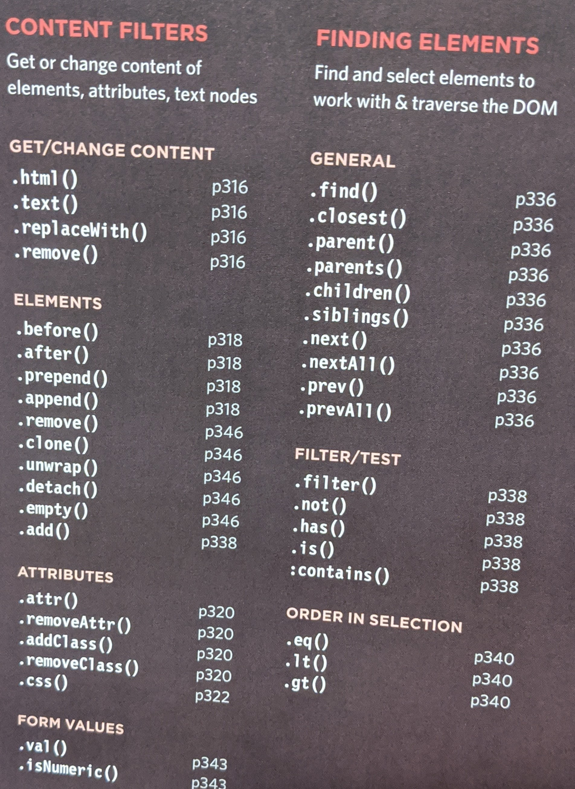
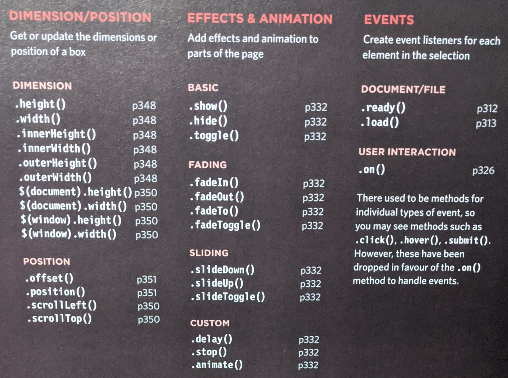

# jQuery, Events, and The DOM

*JavaScript and jQuery book by Jon Duckett pages 293-301, 306-331 and 354-357*

> jQuery is a JavaScript file that you include in your web pages. It lets you find elements using CSS-style selectors and then do something with the elements using jQuery methods.

```js
// $ is the function & in '' is the selector
$('li.hot')
// addClass --> is the method
// 'complete' --> is a parameter
$('li.hot').addClass('complete');

```

In order to use jQuery you have to include the script in the html file.

> minification - involves unnecessary spaces, carriage returns, and commentsbeing stripped from the code, along with other optimizations in order to make the file smaller and faster.

Reasons for using jQuery
* Simple selectors
* Common tasks in less code
  * motto "write less do more"
* Cross browser capability

## BASIC SELECTORS

name | definition
---- | ----
* | All elements
element | All elements with that element name
#id | Elements whose id attribute has the value specified 
.class |Elements whose class attribute has the value specified 
selector, selector 2 | Elements that match more than one selector (see also the add () method, which is more efficient when combining selections)
  
## HIERARCHY 

name | definition
---- | ----
ancestor descendant | An element that is a descendant of another element (e 8-11 a) 
parent > child | An element that the place of the child to select all child elements of the specified parent
previous + next | Adjacent sibling selector only selects elements that are immediately followed by the previous element
previous - siblings | Sibling selector will select any elements that are a sibling of the previous element

## BASIC FILTERS

name | definition
---- | ----
:not (selector) | All elements except the one in the selector (eg.divinot ('summary')
:first  | The first element from the selection
:last | The last element from the selection 
:even  | Elements with an even index number in the selection 
:odd  | Elements with an odd index number in the selection
:eq (index) | Elements with an index number equal to the one in the parameter
:gt(index) | Elements with an index number greater than the parameter
:1t(index) | Elements with an index number less than the parameter 
:header | All \<h1> - \<h6> elements
:animated | Elements that are currently being animated 
:focus | The element that currently has focus elements

## CONTENT FILTERS

name | definition
---- | ----
:contains ('text ) | Elements that contain the specified text as a parameter
:empty | All elements that have no children
:parent | All elements that have a child node (can be text or element) 
:has (selector)| Elements that contain at least one element that matches the selector (e.g., `div:has(p)` matches all div elements that contain a \<p> element
  
## VISIBILITY FILTERS

name | definition
---- | ----
:hidden | All elements that are hidden
:visible | All elements that consume space in the layout of the page Not selected if: display: none; height/ width: 0; ancestor is hidden Selected if: visibility: hidden; opacity: 0 because they would take up space in layout
 

## CHILD FILTERS

name | definition
---- | ----
nth-child(except) | The value here is not zero-based e.g. ul li:nth-child(2)
:first-child| First child from the current selection
:last-child | Last child from the current selection
:only-child | When there is only one child of the element (`div p:only-child`)
 


## ATTRIBUTE FILTERS 

name | definition
---- | ----
[attribute] | Elements that carry the specified attribute (with any value) 
[attribute='value'] | Elements that carry the specified attribute with the specified value
[attribute!='value'] | Elements that carry the specified attribute but not the specified value
[attribute^'value') | The value of the attribute begins with this value
[attributes$='value'] | The value of the attribute ends with this value
[attribute*='value'] | The value should appear somewhere in the attribute value 
[attribute\|='value']| Equal to given string or starting with string and followed by a hyphen
[attributes~='value'] | The value should be one of the values in a space separated list
[attribute] [attribute2]| Elements that match all of the selectors

      

## FORM

name | definition
---- | ----
:input | All input elements
:text | All text inputs
:password| All password inputs
:radio | All radio buttons
:checkbox | All checkboxes
:submit | All submit buttons 
:image | All \ elements 
:reset | All reset buttons
:button | All \<button> elements
:file| All file inputs
:selected | All selected items from drop-down lists 
:enabled | All enabled form elements (the default for all form elements)
:disabled | All disabled form elements (using the CSS disabled property)
:checked| All checked radio buttons or checkboxes

## Content filters & Finding elements


## Dimension/position; Effects & Animations; Events


> When you create a selection with jQuery, it stores a reference to the corresponding nodes in the DOM tree. it does not create copies of them.

> A jQuey object stores references to elements. Caching a jQuery object stores a reference to it in a variable.

`Chaining` - The process of placing several methods in te same selector.

name | definition | example
---- | ---- | ----
.ready() | Checks that the page is ready for your code to work with. | shorthand ```$(function(){//your code goes here})```
.html() | When this method is used to retrieve information from a jQuery selection. | `$('ul').html();`

Four methods for updating all elements in a jQuery selection.
1. .html()
2. .text()
3. .replaceWith()
4. .remove()

Methods for inserting elements

1. .before()
2. .after()
3. .prepend()
4. .append()

Create attributes or access update their content.

1. .attr()
2. .addClass()
3. .removeAttr()
4. .removeClass()

> the .css() method lets you retrieve and set the values of CSS properties.

`.each()` method is used to loop through a list of items and run an anonymous function for each of them.

`.on()` method is used to handle all events

[Main Page](https://will-ing.github.io/reading-notes)