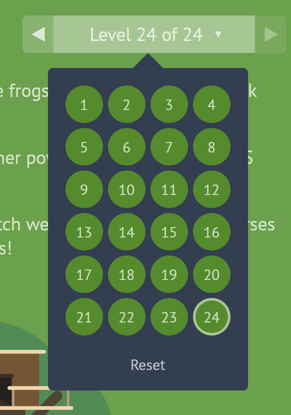

 # Flexbox and Templating

 ## [Mustache.js with Node and Express](https://medium.com/@1sherlynn/javascript-templating-language-and-engine-mustache-js-with-node-and-express-f4c2530e73b2)


 > Javascript templating is a fast and efficient technique to render client-side view templates with Javascript by using a JSON data source.

>Mustache is **NOT** a templating engine. Mustache is a specification for a templating language

```
$ npm install mustache --save
```

### Template

```html
<html>
  <body onload="renderHello()">
    <div id="target">Loading...</div>
    <script id="template" type="x-tmpl-mustache">
      Hello {{ name }}!
    </script>

    <script src="https://unpkg.com/mustache@latest"></script>
    <script src="render.js"></script>
  </body>
</html>
```

### Data -> Json file

```json
{
  "name": {
    "name": "Michael",
    "last": "Jackson"
  },
  "age": "RIP"
}
```

### Render

```js
function renderHello() {
  fetch('template.mustache')
    .then((response) => response.text())
    .then((template) => {
      var rendered = Mustache.render(template, { name: 'Luke' });
      document.getElementById('target').innerHTML = rendered;    
    });
}
```


### [mustach.js in github](https://github.com/janl/mustache.js)


# [A Complete Guide to Flexbox](https://css-tricks.com/snippets/css/a-guide-to-flexbox/)

name | definition
---- | ----
display | This defines a flex container; inline or block depending on the given value.
order| By default, flex items are laid out in the source order. However, the order property controls the order in which they appear in the flex container.
flex-direction | This establishes the main-axis, thus defining the direction flex items are placed in the flex container.
flex-grow | This defines the ability for a flex item to grow if necessary. It accepts a unitless value that serves as a proportion.
flex-wrap | By default, flex items will all try to fit onto one line. You can change that and allow the items to wrap as needed with this property.
flex-shrink | This defines the ability for a flex item to shrink if necessary.
flex-flow | This is a shorthand for the flex-direction and flex-wrap properties, which together define the flex container's main and cross axes. The default value is row nowrap.
flex-basis | This defines the default size of an element before the remaining space is distributed. 
justify-content | This defines the alignment along the main axis. 
flex | This is the shorthand for flex-grow, flex-shrink and flex-basis combined.
align-self | This allows the default alignment (or the one specified by align-items) to be overridden for individual flex items.
align-items | This defines the default behavior for how flex items are laid out along the cross axis on the current line.
align-content | This aligns a flex container's lines within when there is extra space in the cross-axis


```css
.container{
  display: flex;
  flex-direction: row | row-reverse | column | column-reverse;
  flex-wrap: nowrap | wrap | wrap-reverse;
  /* this is shorhand for both */
  flex-flow: <‘flex-direction’> || <‘flex-wrap’>;
  justify-content: flex-start | flex-end | center | space-between | space-around | space-evenly | start | end | left | right ... + safe | unsafe;
  align-items: stretch | flex-start | flex-end | center | baseline | first baseline | last baseline | start | end | self-start | self-end + ... safe | unsafe;
  align-content: flex-start | flex-end | center | space-between | space-around | space-evenly | stretch | start | end | baseline | first baseline | last baseline + ... safe | unsafe;

}

.item {
  order: <integer>;
  flex-grow: <number>; 
  flex-shrink: <number>;
  flex-basis: <length> | auto;
  flex: none | [ <'flex-grow'> <'flex-shrink'>? || <'flex-basis'> ];
  align-self: auto | flex-start | flex-end | center | baseline | stretch;

}

```



[Main Page](https://will-ing.github.io/reading-notes)