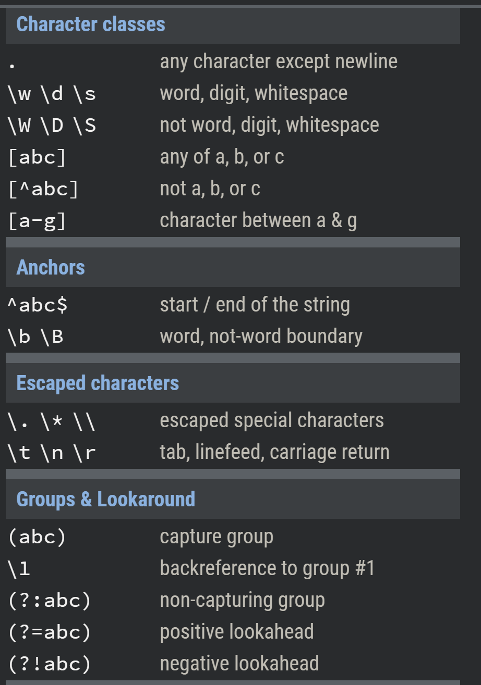
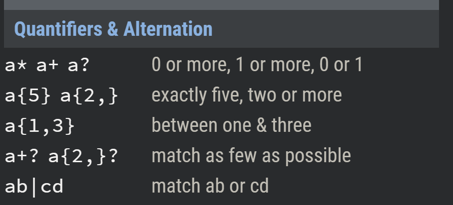

# Responsive Web Design and Regular Expressions

# Regex (Regular Expressions) 

>**Regular expressions** (regex or regexp) are extremely useful in extracting information from any text by searching for one or more matches of a specific search pattern




### [Regex tutorial](https://medium.com/factory-mind/regex-tutorial-a-simple-cheatsheet-by-examples-649dc1c3f285)

# [Responsive Web Design](https://css-tricks.com/snippets/css/complete-guide-grid/)

### Parent Properties

Name | Description
---- | ----
grid | generates a block-level grid
inline-grid | generates an inline-level grid
grid-template-columns; grid-template-rows | Defines the columns and rows of the grid with a space-separated list of values.
\<track-size> | can be a length, a percentage, or a fraction of the free space in the grid (using the fr unit)
\<line-name> | an arbitrary name of your choosing
\<grid-area-name> | the name of a grid area specified with grid-area
. | a period signifies an empty grid cell
none | no grid areas are defined
grid-template | A shorthand for setting` grid-template-rows`, `grid-template-columns`, and `grid-template-areas` in a single declaration.
none | sets all three properties to their initial values
\<grid-template-rows> / \<grid-template-columns> | sets grid-template-columns and grid-template-rows to the specified values, respectively, and sets grid-template-areas to none
grid-column-gap \ grid-row-gap | Specifies the size of the grid lines. You can think of it like setting the width of the gutters between the columns/rows.
grid-gap | A shorthand for `grid-row-gap` and `grid-column-gap`
justify-items | Aligns grid items along the inline (row) axis.
align-items | Aligns grid items along the block (column) axis 
place-items | sets both the `align-items` and `justify-items` properties in a single declaration.
grid-auto-flow | f you have grid items that you don’t explicitly place on the `grid`,


```css
.container {
  /* have to set the display */
  display: grid | inline-grid;

  grid-template-columns: <track-size> ... | <line-name> <track-size> ...;
  grid-template-rows: <track-size> ... | <line-name> <track-size> ...;
  grid-template-areas: 
    "<grid-area-name> | . | none | ..."
    "...";

  /* shorthand way */
  grid-template: none | <grid-template-rows> / <grid-template-columns>;

  /* Another way of doing it that is more readable */
  grid-template:
    [row1-start] "header header header" 25px [row1-end]
    [row2-start] "footer footer footer" 25px [row2-end]
    / auto 50px auto;

  /* shorthand way */
  grid-gap: <grid-row-gap> <grid-column-gap>;

  justify-content: start | end | center | stretch | space-around | space-between | space-evenly;	
  align-items: start | end | center | stretch;
  grid-auto-flow: row | column | row dense | column dense;

}

```
>float, display: inline-block, display: table-cell, vertical-align and column-* properties have no effect on a grid item.

### Child properties

Name | Description
---- | ----
\<line> | can be a number to refer to a numbered grid line, or a name to refer to a named grid line
span \<number> | the item will span across the provided number of grid tracks
span \<name> | the item will span across until it hits the next line with the provided name
auto | indicates auto-placement, an automatic span, or a default span of one
z-index | to control their stacking order.
grid-column; grid-row | Shorthand for grid-column-start + grid-column-end, and grid-row-start + grid-row-end, respectively.
grid-area | Gives an item a name so that it can be referenced by a template created with the grid-template-areas property. Alternatively, this property can be used as an even shorter shorthand for `grid-row-start + grid-column-start + grid-row-end + grid-column-end`.


```css
.item {
  grid-column-start: <number> | <name> | span <number> | span <name> | auto;
  grid-column-end: <number> | <name> | span <number> | span <name> | auto;
  grid-row-start: <number> | <name> | span <number> | span <name> | auto;
  grid-row-end: <number> | <name> | span <number> | span <name> | auto;
  grid-column: <start-line> / <end-line> |<start-line> / span <value>;
  grid-row: <start-line> / <end-line> | <start-line> / span <value>;

  /* shorthand way */
  grid-area: <name> | <row-start> / <column-start> / <row-end> / <column-end>;

  justify-self: start | end | center | stretch;

}

```


[Main Page](https://will-ing.github.io/reading-notes301/)