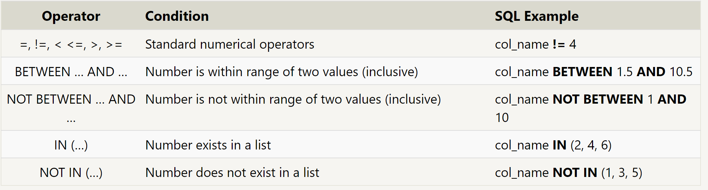
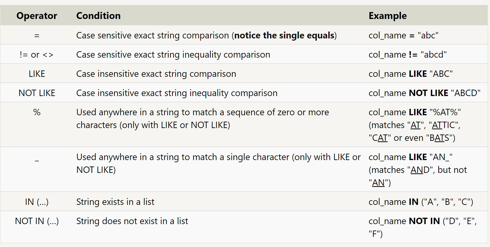

# SQL

> `SQL`, or Structured Query Language, is a language designed to allow both technical and non-technical users query, manipulate, and transform data from a relational database

`SELECT` Statements retrieve data from a database

```sql
SELECT column, another_column, …
FROM mytable;
-- The result of this query will be a two-dimensional set of rows and columns, effectively a copy of the table, but only with the columns that we requested.
```

*Select query for all columns*

```sql
SELECT * 
FROM mytable;
```




*Select query with constraints*

```sql
SELECT column, another_column, …
FROM mytable
WHERE condition
    AND/OR another_condition
    AND/OR …;
```

>`WHERE` - clause is applied to each row of data by checking specific column values to determine whether it should be included in the results or not.

```sql
SELECT title, year FROM movies
WHERE year <= 2003;
-- different ways to use WHERE
```



>`DISTINCT` -  way to discard rows that have a duplicate column value

*Select query with unique results*

```sql
SELECT DISTINCT column, another_column, …
FROM mytable
WHERE condition(s);
```

>`ORDER BY` - sort your results by a given column in ascending or descending

*Select query with ordered results*

```sql
SELECT column, another_column, …
FROM mytable
WHERE condition(s)
ORDER BY column ASC/DESC;

```

>`Schema` - what describes the structure of each table, and the datatypes that each column of the table can contain.

> `INSERT` - declares which table to write into, the columns of data that we are filling, and one or more rows of data to insert

```sql
INSERT INTO mytable
VALUES (value_or_expr, another_value_or_expr, …),
       (value_or_expr_2, another_value_or_expr_2, …),
       …;
```

> `UPDATE` - common task is to update existing data, he data you are updating has to match the data type of the columns in the table schema.

*Update statement with values*

```sql
UPDATE mytable
SET column = value_or_expr, 
    other_column = another_value_or_expr, 
    …
WHERE condition;
```

>`DELETE` - delete data from a table in the database

*Delete statement with condition*

```sql
DELETE FROM mytable
WHERE condition;
```

>`CREATE TABLE` - Create a new database table

*Create table statement w/ optional table constraint and default value*

```sql
CREATE TABLE IF NOT EXISTS mytable (
    column DataType TableConstraint DEFAULT default_value,
    another_column DataType TableConstraint DEFAULT default_value,
    …
);
```

[Main Page](https://will-ing.github.io/reading-notes)