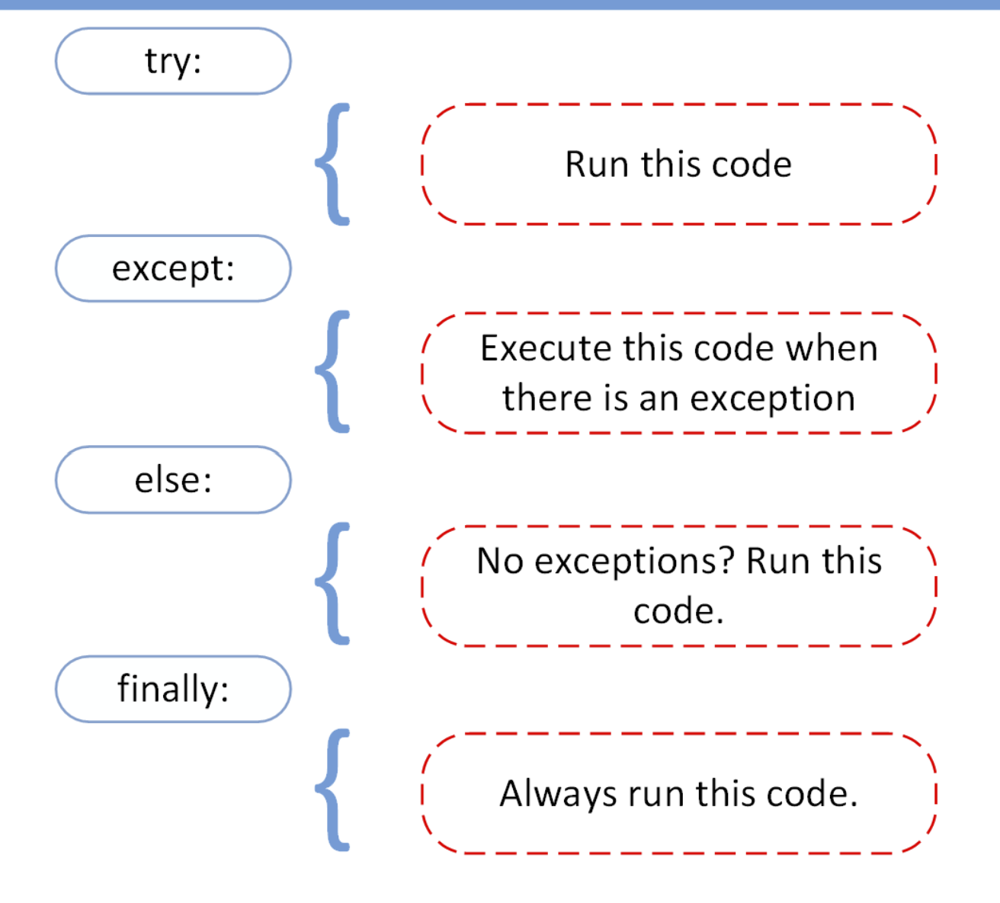

# Files

`Files` have 3 different parts -

* Header: metadata about the contents of the file (file name, size, type, and so on)
* Data: contents of the file as written by the creator or editor
* End of file (EOF): special character that indicates the end of the file

`File Path` is broken up in to 3 parts

*Folder Path: the file folder location on the file system where subsequent folders are separated by a forward slash / (Unix) or backslash \ (Windows)
* File Name: the actual name of the file
* Extension: the end of the file path pre-pended with a period (.) used to indicate the file type

>  line endings should use the sequence of the Carriage Return (CR or \r) and the Line Feed (LF or \n) characters (CR+LF or \r\n)

use `open()` to open a file. *You should always properly close a file*

```
reader = open('dog_breeds.txt')
try:
    # Further file processing goes here
finally:
    reader.close()
```

You can also use `with`. Automatically takes care of closing the file.

```
with open('dog_breeds.txt', r) as reader:
    # Further file processing goes here
```

you’ll also want to use the second positional argument, `mode`.

* `r` is for read
* `w` is for write

`File Object` - “an object exposing a file-oriented API (with methods such as read() or write()) to an underlying resource.”

# Exceptions

`Exceptions error` -  This type of error occurs whenever syntactically correct Python code results in an error. The last line of the message indicated what type of exception error you ran into.

> use `raise` to throw an exception if a condition occurs. The statement can be complemented with a custom exception.

> The `try` and `except` block in Python is used to catch and handle exceptions

using the `else` statement, you can instruct a program to execute a certain block of code only in the absence of exceptions.

