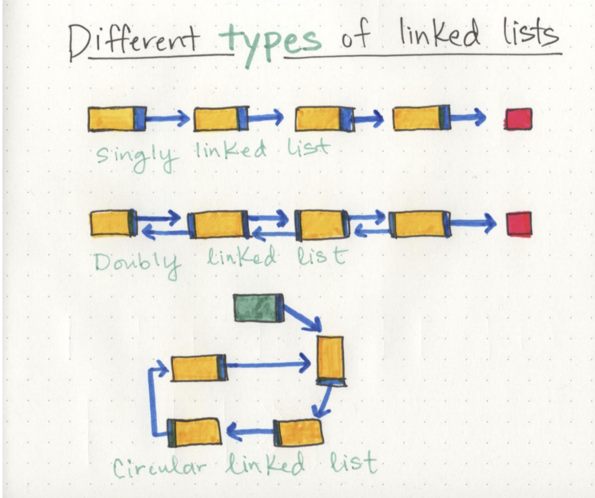

# Linked lists

 > `Linked List` - is a sequence of Nodes that are connected/linked to each other.

 Types of linked lists -

- Singly - means that there is only one reference, and the reference points to the Next node in a linked list.
- Doubly - means that there is a reference to both the Next and Previous node.




**Notables**

- When traversing a linked list you are not able to use a foreach | for loop.
- Use the Next value in each node
- Best way to approach a traversal is through the use of a `while` loop. You can check that the `Next` node in the list is null.

**Parts of Linked Lists**

- Nodes - Elements of the lists
- Head - Starting point
- Null - end of the list; usually an empty value.

> `NullReferenceException` gets thrown trying to traverse on a node that is null

> `Current` - will tell us where exactly in the linked list we are and will allow us to move/traverse forward until we hit the end.


```py
# if linked list includes a value
def Includes(value):
  Current = Head

  while Current != None:
    if Current.Value == value
      return True
    
    Next(Value)

  return False
```

Big O of `Time` for includes would be `O(n)` = n represents the number of nodes in the list.\
Big O of `space` for includes would be `O(1)` = there is no additional space being used than what is already given to us with the linked list input.

---

## **Big O Notation**

> `Big O `Notation is a way of evaluating the performance of an algorithm.

For linked lists there is two types of Big O equations to remember are O(1) and O(n).

- An `O(1) function` takes `constant time`, which is to say that it doesn’t matter how many elements we have, or how huge our input is: it’ll always take the same amount of time and memory to run our algorithm.

- An` O(n) function` is `linear`, which means that as our input grows (from ten numbers, to ten thousand, to ten million), the space and time that we need to run that algorithm grows linearly.

[Main Page](https://will-ing.github.io/reading-notes)