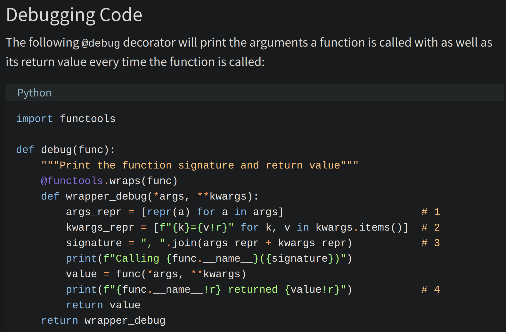

# List Comprehension

`List comprehensions` - provide a concise way to create lists.

The list comprehension starts with a `‘[‘` and `‘]’`square brackets, to help you remember that the
result is going to be a list.

```py
for item in list:
    if conditional:
        expression

# this is the same as above
new_list = [expression(i) for i in old_list if filter(i)]
```

This is list with loops

```py
# You can either use loops:
squares = []

for x in range(10):
    squares.append(x**2)

print squares
[0, 1, 4, 9, 16, 25, 36, 49, 64, 81]

# Or you can use list comprehensions to get the same result:
squares = [x**2 for x in range(10)]

print squares
[0, 1, 4, 9, 16, 25, 36, 49, 64, 81]
```

----
## First-Class Objects

In Python, functions are `first-class objects`. This means that functions can be passed around and used as arguments, just like any other object (string, int, float, list, and so on). Consider the following three functions:

Functions inside other functions are called `inner functions`.

----

## Returning Functions From Functions

Python also allows you to use functions as return values. The following example returns one of the inner functions from the outer parent() function:

----

## Simple Decorators

Now that you’ve seen that functions are just like any other object in Python, you’re ready to move on and see the magical beast that is the Python decorator.



[Main Page](https://will-ing.github.io/reading-notes)