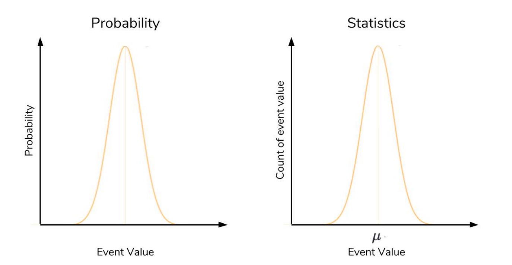

# Dunder

`Dunder Methods` - special methods are a set of predefined methods you can use to enrich your classes.

- Dunder methods let you emulate the behavior of built-in types.
- also sometimes called “magic methods.”

- Enriching the simple account class
- Initialization of new objects
- Object representation
- Enable iteration
- Operator overloading (comparison)
- Operator overloading (addition)
- Method invocation
- Context manager support (with statement)

## Probability

`probability` - seeks to answer the question, “What is the chance of an event happening?” An event is some outcome of interest.

These two events form the **sample space**, the set of all possible events that can happen.

The `normal distribution` refers to a particularly important phenomenon in the realm of probability and statistics.

The most important qualities to notice about the `normal distribution` is its symmetry and its shape.

[Main Page](https://will-ing.github.io/reading-notes)