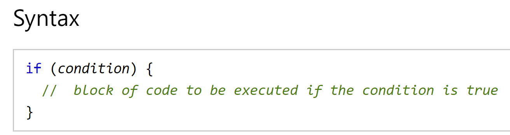

# Chapter 2: “Text” (pp.40-61)

name|description| example
---- | ---- | ----
Headings | There are 6 level of headings: \<h1> \<h2> \<h3> \<h4> \<h5> \<h6> | \<h1>\</h1> - Main headings
Paragraphs | Consists of one or more sentences | \
\

Bold | Make the characters bold | \<b>
Italic | Used to say something in a different way then the surrounding context. | \<i>
Superscript | Suffixes of dates or mathematical concepts like rasing a number | \
Subscript | Commonly used for foot notes or chemical formulas | \
White space | In order to make code easier to read pages often add extra spaces on a new line |
Line breaks | It will show the paragraph or header on a new line | \ 
Horizontal rules | To create breaks between themes - such as change of topic | \

**Strong** | Indicates the content has strong importance | \<strong>
Emphasis | subtly changes the meaning of sentence. | \<em>
Blockquote| Used for longer quotes that take up an entire page | \<blockquote>
quotes| Is used for shorter quotes | \<q>
abbreviation | For acronyms. Usually uses a title attribute on the opening tag | \
\<abbr title="example">ex\<abbr>
citation | When you are referencing a piece of work. | \<cite>
Definition | First time you explain some new terminology. | \<dfn>
Address | Contains contact details of the author | \<address>
Insert | Show the content that has been inserted. Usually underlined | \<ins>
Delete | Content usually has a strike through line. *You can also use an \<s> element* | \<del>

# Chapter 10: Ch.10 “Introducing CSS” (pp.226-245)

>CSS - allows you to create rules that specify how the content of an element should appear.

name|description| example
---- | ---- | ----
Selector | Which element the rule is applied to | **p** {}
Declaration | How the element referred to should be styled | **{background-color: blue;}**
Properties | Indicates the aspects of the elements you want to change | **color**: green;
Values | Specify the setting you want to use for the properties |color: **green**;

## **External CSS**

name|description| example
---- | ---- | ----
link | Used to tell an HTML element where to find CSS | \<link href="css/styles.css" type="text/css" rel="stylesheet" />

## **Internal CSS**

name|description| example
---- | ---- | ----
Style Element | You can include CSS rules within you HTML page by placing them inside a \<style> element. | \<head>\<style type="text/css">body {font-family: arial;}\</head>

## CSS selectors

Name|Description
----- | -----
Type| matched element names
Class| matches the class attribute that is specified after a period. Cover multiple text.
ID| Matches the value of the one that is specified after the hashtag symbol. Used for specific parts of the page.
Child| matched the element that is a direct child of another
Descendant| Matches an element that is a descendant of another element ex: p a {}
Adjacent sibling| Matches the next sibling of another.
General sibling| Matches and element that is a sibling of another although it does not have to be the directly preceding element.

> How rules cascade - **Last rule** can override by **Specifity** and if you put **!** after any property value it is most important. **Specifity** = Type>Class>ID

>You should use **external style sheets** so that multiple web pages cna share, the site will load faster, you don't have to change the rules on every page

# Chapter 2: “Basic JavaScript Instructions” (pp.53-84)

Type| Description| Example
---- | ---- | ----
Script| is a series of instructions that a computer can follow one-by-one.
Statement| each step in a script. Should end in a ;. These are instructions and should start on a new line.
Code Blocks| statements that are surrounded by curly braces. They should **not** be followed by a semicolon.
Comments| you should write comments explaining what your code does.
Multi line| comments over multiple lines| starts with /* and ends with */
Single line| anything that follows the two forward slash comments| // comment
Variable| Stores data temporarily in a script so it can work. The data changes or varies what each script does.| Var "variable name" = "value";
Booleans| True or false values| true
numbers| handles numbers or integers. These are not written in quotes| 1 2 3
String| consists of letters; values are immutable. Can't be altered.| abc
Assignment operator| Remember that everything to the right of the equals sign is evaluated first
Camel case| upper case that follows the word. js does not use spaces in var
Concatenating| link (things) together in a chain or series
floats| Decimal numbers
multi-dimensional array| nested arrays within other arrays| [[ 3, 4, 5] + [3]]

## **Expressions**

> an **expression** evaluates in to a single value.
* Expressions that are just **assigned** to a variable - var color = green;
* Expressions that use **two** or more values to **return** a **single** value - var area = 3 * 2;

## **Operators**

> Operators allow programmers to create a single value from one or more values.

Type| Description| Example
---- | ---- | ----
Assignment operators| Assign a value to a variable| color = 'green';
Arithmetic operators| Perform basic math| area = 3 * 2;
String operators| combine two strings| greeting = 'hi' + 'molly';
comparison operators|Compare two values and return true or false| = 3 > 5; *pg 150*
Logical operators| Combine expressions and return true or false| buy = (5 > 3) && (2 < 4); *pg 156*

### Arithmetic operators *pg 76*

Type| Description| Example
---- | ---- | ----
Addition|| +
Subtraction|| -
Division|| /
Multiplication|| *
increment| Adds one to the current number| ++
Decrement| Subtracts one to the current number| --
Modulus| divides two values and returns the remainder| 10 % 3 = 1

*There is only one string operator, the + symbol

Example:
* var firstName = 'ivy';
* var lastName = 'Stone';
* var fullName = firstName + lastName;

> Mainly used for personalized messages

### Assignment, Comparison and Logical Operators

keyword| Description
---- | ---- 
==| is equal to
!=| is not equal to
===| strict equal to
!==| strict not equal to
\>| greater than
<| less than
\>=| greater than or equal to
<=| less than or equal to
&&| logical and; test more than one condition
\|\|| logical or; test at least one condition
!| Logical not; takes single boolean value and inverts it

*n order for JavaScript to compare two different data types (for example, numbers and strings), it must convert one type to another. This is known as "**Type Coercion**"*

# Chapter 4: “Decisions and Loops” only up to the section on switch statements (pp.145-162)

## Operators

keyword | Description
---- | ---- 
==| is equal to
!=| is not equal to
===| strict equal to
!==| strict not equal to
\>| greater than
<| less than
\>=| greater than or equal to
<=| less than or equal to
&&| logical and; test more than one condition
\|\|| logical or; test at least one condition
!| Logical not; takes single boolean value and inverts it

*logical evaluation are done from left to right*

## Loops

> Loops - check a condition. If it returns true, a code block will run. then the condition will be checked again and if it still returns true, it will run again. this repeats until the condition returns false.

### Loops

types | Description | Example
---- | ---- | ----
For| If you need to run a code a specific number of times. Often used to loop thought the items in an array| for ( i = 0; i > 10; i++){document.write(i)}
While| If you do not know how many times the code should run. 
Do while| Key difference: it will always run the statements inside the curly braces at least once, even if the condition evaluates to false

### Loop counters

types| Description
---- | ---- 
Initialization| Create a variable and set it to 0. This variable is commonly called i, and it acts as the counter; var i =0;
condition| The loop should continue to run until the counter reaches a specified number.;i < 10;
Update| Every time the lop has run the statements in the curly braces, it adds one to the counter.; i++

### Key loops

Consider three points:
* **Keywords** - **break**: causes termination of the loop. **continue**: tells the interpreter to stop the current iteration, and then update and check the condition again.
* **Loops & Arrays** - loops can help run the same code for each item in the array.
* **Performance issues** - can make the page slower. Can get an infinite loop.

for loop example:
\

## If Statements

> **if statements** - tells JavaScript to execute the code in the curly braces under certain conditions, defined in the parentheses.

*Courtesy of W3 schools*

[Main Page](https://will-ing.github.io/reading-notes)