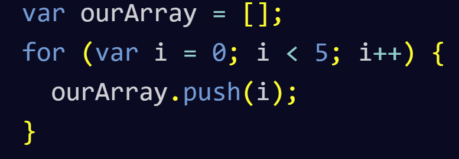

# HTML Lists, CSS Boxes, JS Control Flow

# Chapter 3: “Lists” (pp.62-73)

Type| Description| Example
---- | ---- | ----
Ordered Lists | are lists where each item in the list is numbered. | \<ol>\<li>
Unordered lists | are lists that begin with a bullet point | \<ul>\<li>
Definition lists | are made up of a set of terms along with the definitions for each of those terms | \<dl>
Definition Term | Used to contain the term | \<dt>
Definition | Contains the definition | \<dd>
Nested lists | are lists contained in lists | \<li>\<li>

# Chapter 13: “Boxes” (pp.300-329)

> Boxes have 2 dimensions **width** and **height**.

Type| Description| Example
---- | ---- | ----
Limiting Width | Specifies the smallest size and the largest of a box's width | max-width:200px; min-width:50px;
Limiting Height | Specifies the smallest size and the largest of a box's height | max-height: 30px; min-height: 10px;
Overflow | Tells the browser what to do if the content contained within a box is larger that the box itself. Values: **hidden** or **scroll** | overflow: hidden; overflow: scroll;
Border width | Controls width of a border | border-width: (thin, medium, thick)
Border style | Changes the styles of the border | 

# Chapter 4: “Decisions and Loops” from switch statements on (pp.162-182)

Type| Description| Example
---- | ---- | ----
Switch Statements | Starts with a variable called the switch value. Each case indicates a possible value for this variable and the code that should run if the variable matches that value. | switch () {case 'one': ; case 'two': '}
Type coercion | When js converts data types behind the scenes to complete an operation. | string '1' can me converted to number 1
Falsy | values are treated as if they are true | Boolean false; number 0; empty strings; NaN; variable with no value;
Truthy| Values are treated as if they are true | Boolean true; Numbers other than 0; Strings with content; number calculations; true written as a string; false written as a string.
Unary operator | returns a result with just one operand. |

## Loops

> Loops - check a condition. If it returns true, a code block will run. then the condition will be checked again and if it still returns true, it will run again. this repeats until the condition returns false.

### Loops

types | Description | Example
---- | ---- | ----
For| If you need to run a code a specific number of times. Often used to loop thought the items in an array| for ( i = 0; i > 10; i++){document.write(i)}
While| If you do not know how many times the code should run. 
Do while| Key difference: it will always run the statements inside the curly braces at least once, even if the condition evaluates to false

### Loop counters

types| Description
---- | ---- 
Initialization| Create a variable and set it to 0. This variable is commonly called i, and it acts as the counter; var i =0;
condition| The loop should continue to run until the counter reaches a specified number.;i < 10;
Update| Every time the lop has run the statements in the curly braces, it adds one to the counter.; i++

### Key loops

Consider three points:
* **Keywords** - **break**: causes termination of the loop. **continue**: tells the interpreter to stop the current iteration, and then update and check the condition again.
* **Loops & Arrays** - loops can help run the same code for each item in the array.
* **Performance issues** - can make the page slower. Can get an infinite loop.

for loop example:

  
[Main Page](https://will-ing.github.io/reading-notes)