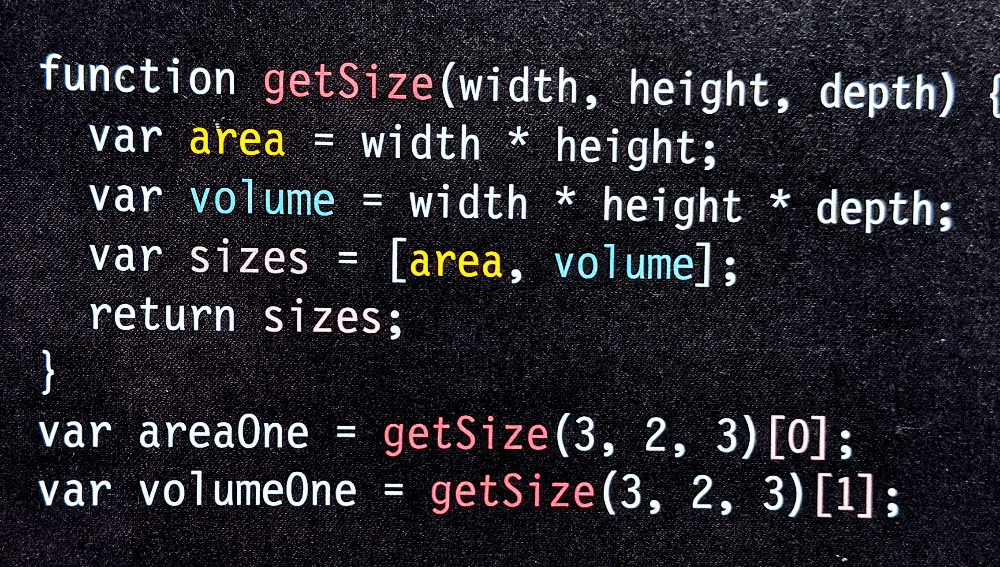
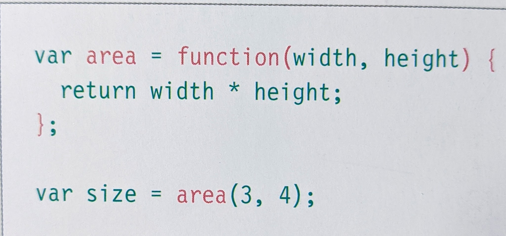
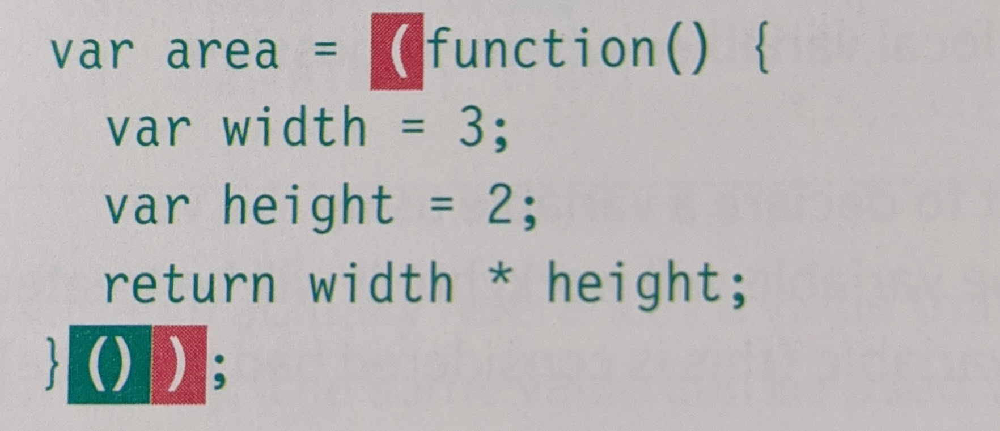

# HTML Links, CSS Layout, JS Functions

# Chapter 4: Ch.4 “Links” (pp.74-93)

>Links are the defining feature of the web because they allow you to move from one web page to another.

Type| Description| Example
---- | ---- | ----
Anchor tag | is the tag that creates the link to other pages | \<a href="url">name\</a>
Relative URLs | Used when linking to other pages within the same site |
Absolute URLs | Used when going to a specific site of a page |
email links | To create a link that starts up the user's email program and addresses an email to a specified email address, you use the `<a>` element. The value of href starts with mailto: | `<a href="mailto:jon@email.com">email jon</a>`
Opening new windows | Use the `target` attribute to open a link in a new window | `a href="URL" target="_blank">name</a>`
Linking on the same page | Used for when your page is really long and you want the user to get to a specific part | `<a href="#example">example</a> <h2 id="example"><h2>`

# Chapter 15: “Layout” (pp.358-404)

Type| Description| Example
---- | ---- | ----
Block-level elements | start on a new line and act as the main building blocks of any layout. | `<h1> 
 <ul> <li>`
inline elements | Flow in between surrounding text | ` <b> <i>`
Containing elements | The outer box when one block is inside another block. 
Positioning schemes | Normal Flow, relative, absolute, fixed floating |

# Chapter 3 (first part): “Functions, Methods, and Objects” (pp.86-99 ONLY)

> **Functions** let you group a series of statements together to perform a specific task. If different parts of a script repeat the same task, you can reuse the function.

keyword| Description
---- | ---- 
Calling| When you are retrieving a function.
Parameters| information passed to a function.
Return Value| The answer the function gives you.
function keyword| Identifying that it is a function.
function name| What identifies the function. follows the function keyword
Code block| the code in between the curly braces.
queue| an abstract Data Structure where items are kept in order
Example: 

>Function Expressions - when you put a function where the interpreter would expect to see an expression.

example

> Immediately invoked function - pronounced **iffy**, these functions are not gives a name. Instead they are executed once.

> Parameter vs Arguments - Arguments specify values. Parameters don't.

# Article: “6 Reasons for Pair Programming”

1. iterative loops
2. Code reviews
3. fast feedback
4. error checking
5. linting

>This dramatically improves the quality of code that software devs use

### how it works

>driver
* Only one with hands on the computer
* handles the mechanics

>navigator
* uses their words to guide the driver.
* Thinks about the big picture
* what comes next
* uses there computer to look up solutions and documentation

### Four fundamentals for learning a language

1. Listening
2. Reading
3. writing
4. speaking

>Research indicates that pair programing takes slightly longer, but produces higher-quality code that doesn’t require later effort in troubleshooting and debugging 

[Main Page](https://will-ing.github.io/reading-notes)