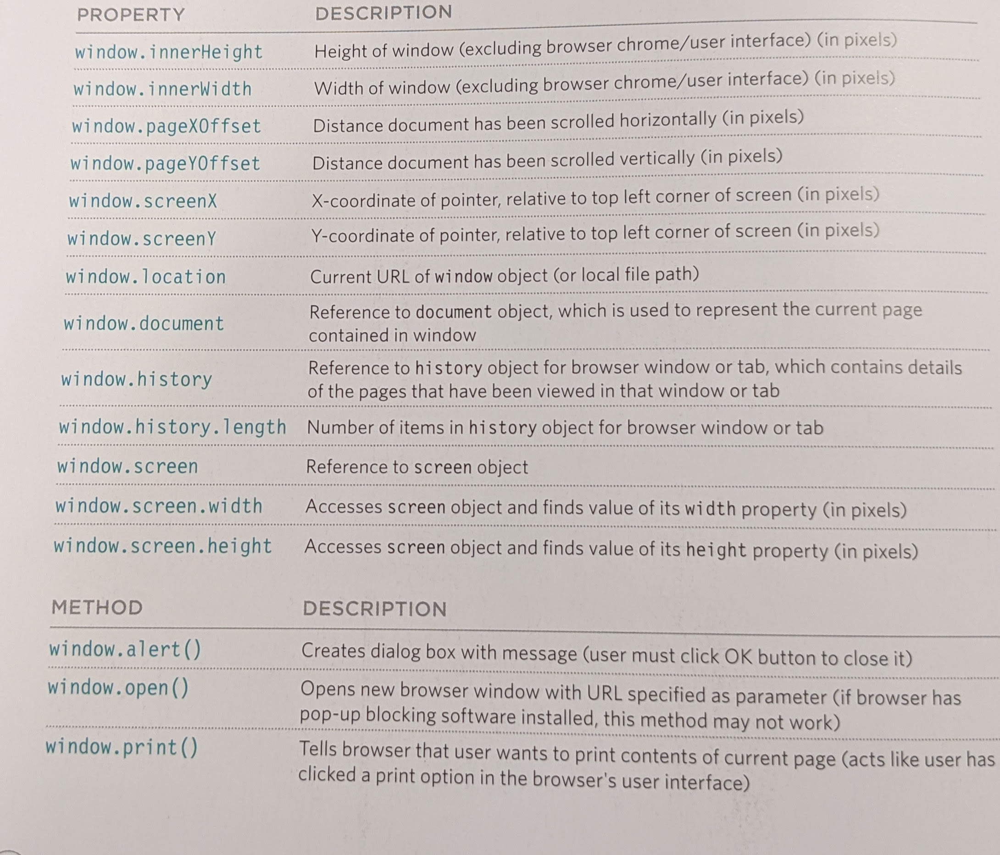
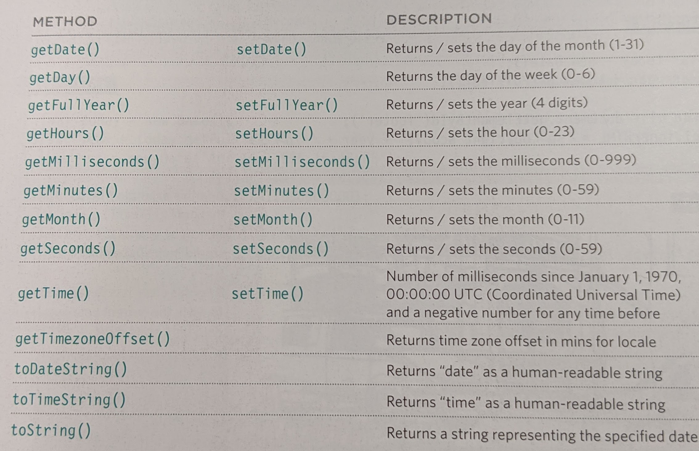

# HTML Tables; JS Constructor Functions


# Domain modeling

Example of creating a constructor function. 

```
var epicFailVideos = function(epicRating, hasAnimals) {
  this.epicRating = epicRating;
  this.hasAnimals = hasAnimals;
}

var parkourFail = new epicFailVideos(7, false);
var corgiFall = new epicFailVideos(4, true)
```

**object oriented programing**

* The new keyword instantiates (i.e. creates) an object.
* The constructor function initializes properties inside that object using the this variable.
* The object is stored in a variable for later use.

**Key notes**

* When modeling a single entity that'll have many instances, build self-contained objects with the same attributes and behaviors.
* Model its attributes with a constructor function that defines and initializes properties.
* Model its behaviors with small methods that focus on doing one job well.
* Create instances using the new keyword followed by a call to a constructor function.
* Store the newly created object in a variable so you can access its properties and methods from outside.
* Use the this variable within methods so you can access the object's properties and methods from inside.

# Chapter 6: “Tables” (pp.126-145)

>use `<tabel>` element in HTML.

* th = table header
* tr = table row
* td = table data


# Chapter 3: “Functions, Methods, and Objects” (pp.106-144)

>The new keyword and the object constructor create a blank object. You can then add properties and methods to the object.

```js
var hotel = new Object();

hotel.name= 'quay';
hotel.rooms = 40;
hotel.booked = 25;

hotel.checkAvailability = function() {
  return this.rooms - this.booked;
};
```
>To update values of properties, use dot notation or square brackets. They work on objects created. To delete properties use `delete` keyword;

```js
hotel.name = 'park'; //changes property
delete hotel.name; // deletes property
```

>you can use `functions` to create `objects`.

```js
function hotel(name,rooms, booked){
  this.name = name; // properties
  this.rooms = rooms;
  this.booked = booked;

  this.checkAvailability = function() { //method
    return this.rooms - this.booked;
  };
}
```
> You can use the `new` keyword to followed by a function to created a new object

```js
var quayHotel = new hotel("quay', 40, 25);
```

Type| Description| Example
---- | ---- | ----
Browser Object Model | Contains objects that represent the current browser window or tab. Like browser history
Document Object Model | Uses objects to create a representation of the current page. It creates a new object for each link.
Global Javascript Objects | represent things that the java script language needs to create a model of.

### The Window object



### Document object

**Tell you about the current page**

Property| Description| Example
---- | ---- | ----
document.title | Title of current document
document.lastModified | Date on which document was last modified
document.URL | Returns string containing URL of current document 
document.domain | returns domain of current document

**Amending contents of the page**
Method | Description| Example
---- | ---- | ----
document.write() | writes text to document
document.getElementById() | Returns element, f there is an element with the value of the id attribute that matches
document.querySelectionAll() | Returns list of elements that match a CSS selector, which is specified as a parameter
document.createElement() | Creates new element (p222)
document.createTextNode() | Creates new text node (p222)

### Global Objects

Property| Description| Example
---- | ---- | ----
length | returns number of character in the string in most cases

Method | Description| Example
---- | ---- | ----
toUpperCase() | Changes string to uppercase characters
toLowerCase() | Changes string to lower case characters
charAt() | Takes an index number as a parameter and returns the character found at that position
indexOf() | Returns index number of the first time a character or set of characters ifs found within the string
lastIndexOf() | Returns index number of the last time a character or set of characters is found within a string.
substring() | Returns character found between two index numbers where the character for the first index number is included and the character for the last index number is not included.
split() | When a character is specified, it splits the string each time it is found, then stores each individual part in an array.
trim() | removes whitespace from start and end of string
replace() | Like find and replace, it takes one value that should be found, and another to replace it. (only replaces the first match it finds)

**Number Objects**

Method | Description| Example
---- | ---- | ----
isNAaN() | Checks if the value is not a number
toFixed() | Rounds to specified number of decimal places
toPrecision() | Rounds to total number of places
toExponential() | Returns a string representing the number in exponential notation.


**Math Objects**

Property| Description| Example
---- | ---- | ----
Math.PI | Returns pi (3.14)

Method | Description| Example
---- | ---- | ----
Math.round() | Rounds number to the narest integer
Math.sqrt(n) | Returns square root of positive nubmer
Math.ceil() | Rounds number uup to the nearest integer
Math.floor() | Rounds number down to the nearest integer
Math.random() | Generates a random number between 0

**Date Objects**



[Main Page](https://will-ing.github.io/reading-notes)