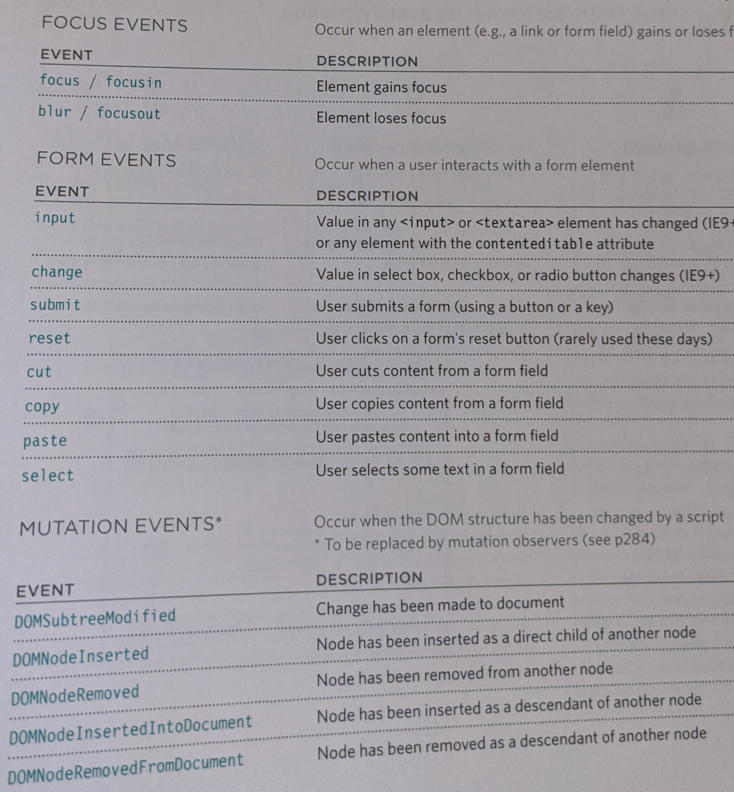

# Forms and Events

# Chapter 7: “Forms” (p.144-175)

### Adding Text

types | Description | Example
---- | ---- | ----
Text input | used for single line text
Password input | Masks the characters entered
Text area | for longer areas of text, such as messages and comments

#### Making Choices

types | Description | Example
---- | ---- | ----
Radio Buttons | when you need to select one number
Checkboxes | select and unselect one or more options
Drop-down boxes | When a user must pick one of a number of options from a list

### Submitting forms

types | Description | Example
---- | ---- | ----
Submit buttons | send data from your form to another web page
Image buttons | Similar to submit buttons but they allow you to use an image
File upload | Allows users to upload files to a website


Dropdown list box
```html
<select name="device" size="3" multiple="multiple"> <!--allows for multiple options -->
  
  <option value="first">first</option>
  <option value="second">second</option>
  <option value="third">third</option>
</select>
```
 types | Description | Example
---- | ---- | ----
file input box | allows user to upload a file | `type="file"`
Image button | If you want to use an image | `type="image"`
button | more control on how the `<button>` appears | 
Hidden | allows web page authors to add values to forms users can't see. | `type="hidden"`
label | allows for more control
fieldset | Group form controls together | `<fieldset>`
legend | element that comes directly after the opening fieldset | `<legend>`
Date input | If you are asking the user for the date | `type="date"`
Email | used for email | `type="email"`
URL | Asking for web page address | `type="URL"`
search | Used for search queries | `type="search"`

# Chapter 14: “Lists, Tables & Forms” (pp.330-357)  

 types | Description | Example
---- | ---- | ----
list-style-type | Change the type the list bullet points show up as
list-style-image | you can use images for the bullet points
list-style-position | you can position the points `inside` and `outside`
cursor styles | changes the cursor | `auto, crosshair, default, pointer, move, test, wait, help`

# Chapter 6: “Events” (pp.243-292)



### Three steps involved in getting it to **trigger** some javascript code.
* select the `element` node
* Indicate which `event` on the selected node will trigger the reponse
* State the `code` you want to run when the event occurs

[Main Page](https://will-ing.github.io/reading-notes)